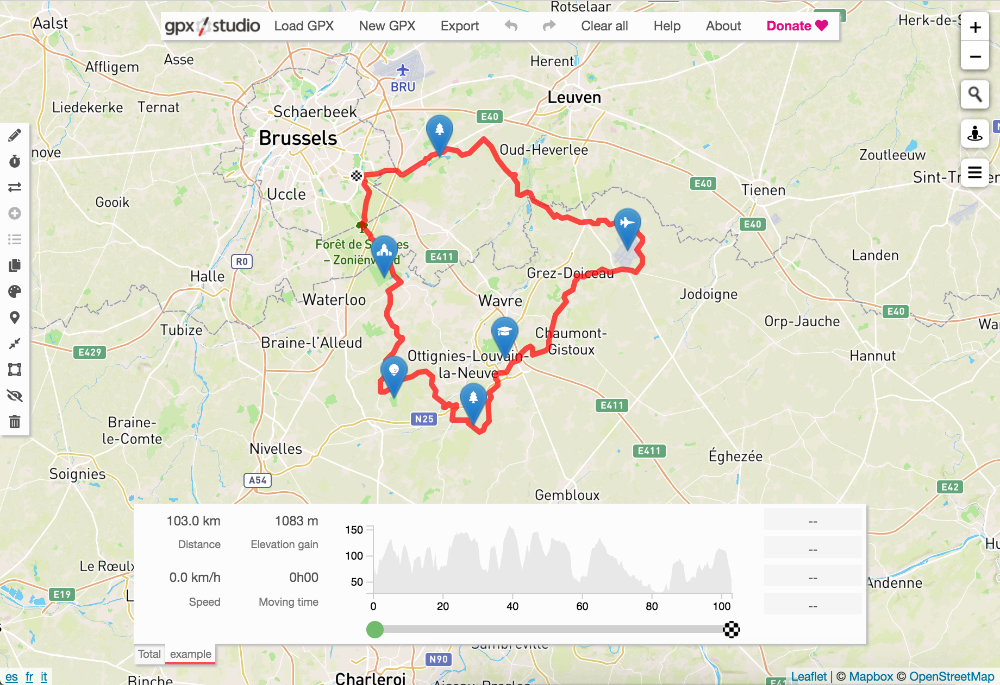

This repository contains the source code of the website [gpx.studio](https://gpxstudio.github.io), an online tool for GPX editing.

## Disclaimer
You are welcome to use parts of the code for your personal projects but **please do not host a clone of the website**.
If you think something is missing from the website, please create an issue to discuss it or make a pull request if you can implement it yourself.

**If you wish to integrate this project in your own website, _please first get in touch_ (except for the embedding mode of course).**

## Run the code

To play with the code locally:
* Get your own token at [Mapbox](https://www.mapbox.com/) and put it in the directory `res` under `mapbox_token.txt`.
* Launch a local server in the root directory, for example using `python3 -m http.server`.

## Features
* Import GPX files
* Draw new routes
* Edit traces : move, insert and delete points
* Cut from the start or the end
* Change the starting time and average speed of the activity
* Add timestamps with constant speed or adapted to the elevation profile
* Undo and redo
* Duplicate trace
* Reverse trace
* Simplify trace
* Merge traces
* Support for waypoints : place and drag, edit information, duplicate
* Support for track segments (trkseg) : extraction with smart waypoints matching and merge as track segments
* Delete points and/or waypoints inside or outside a rectangle selection
* Export multiple traces as one or separately in the chosen order and respecting time precedence constraints (if any time data)
* Preserve and automatically extend speed, heart rate, cadence, power and temperature data
* Drag and drop to load and export files
* Support as many traces as you want with scrollable tabs
* Cycling and hiking maps, and Strava Heatmap layer
* Google Drive integration : select a file, save the new version and get a shareable link as well as code to embed the map

## Future developments
* Snap trace on road network or smooth trace
* Color lines with elevation or speed data

## Translation

The website is translated by volunteers on a collaborative translation platform.
You can help complete and improve the translations by joining the [Crowdin project](https://crowdin.com/project/gpxstudio).
If you would like to start the translation in a new language, contact me or create an issue.
Apart from a good understanding of **gpx.studio**, some basic knowledge of HTML can be useful. Any help is greatly appreciated!

## Acknowledgements
This project would not have been possible without the following amazing projects :
* [Leaflet](https://leafletjs.com/) : awesome map library
* [leaflet-gpx](https://github.com/mpetazzoni/leaflet-gpx) : parsing GPX files
* [Leaflet.Elevation](https://github.com/MrMufflon/Leaflet.Elevation) : elevation profile
* [Leaflet.Icon.Glyph](https://github.com/Leaflet/Leaflet.Icon.Glyph) : markers with icons for the waypoints
* [Leaflet.TextPath](https://github.com/makinacorpus/Leaflet.TextPath) : direction markers
* [leaflet-distance-markers](https://github.com/adoroszlai/leaflet-distance-markers) : distance markers
* [leaflet-control-window](https://github.com/mapshakers/leaflet-control-window) : centered windows for all dialogs
* [leaflet-control-geocoder](https://github.com/perliedman/leaflet-control-geocoder) : search for locations with chosen API
* [tilebelt](https://github.com/mapbox/tilebelt) : find correct tiles to request and access elevation data
* [PNG.js](https://github.com/arian/pngjs) : read raw PNG data to decode elevation from [Mapbox Terrain-RGB tiles](https://docs.mapbox.com/help/troubleshooting/access-elevation-data/#mapbox-terrain-rgb)
* [simplify2](https://github.com/geonome/simplify2-js) : line simplification algorithm
* [js-xss](https://github.com/leizongmin/js-xss) : HTML sanitizer for waypoint text fields
* [SortableJS](https://github.com/SortableJS/Sortable) : for swapping the tabs
* [Font Awesome](https://fontawesome.com/) : nice icons

And the data, maps and APIs from [Mapbox](https://www.mapbox.com/), [OpenStreetMap](https://www.openstreetmap.org/), [OpenTopoMap](https://opentopomap.org/), [Maps.Refuges.Info](https://wiki.openstreetmap.org/wiki/Hiking/mri), [CyclOSM](https://www.cyclosm.org/), [IGN](https://geoservices.ign.fr/) and [Strava](https://strava.com).
